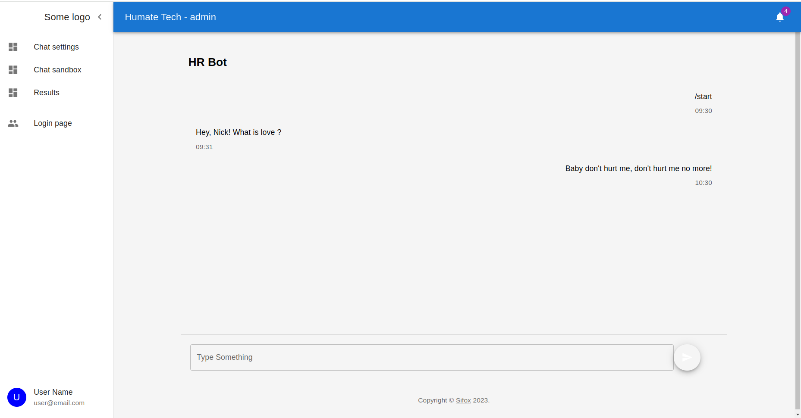
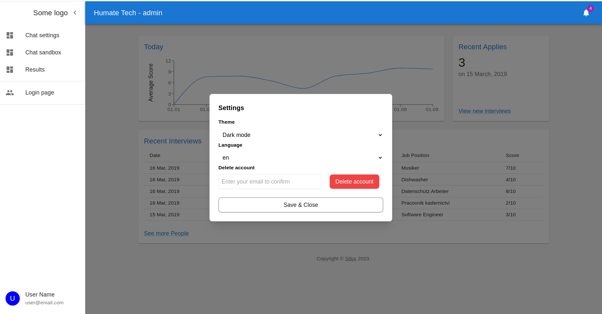
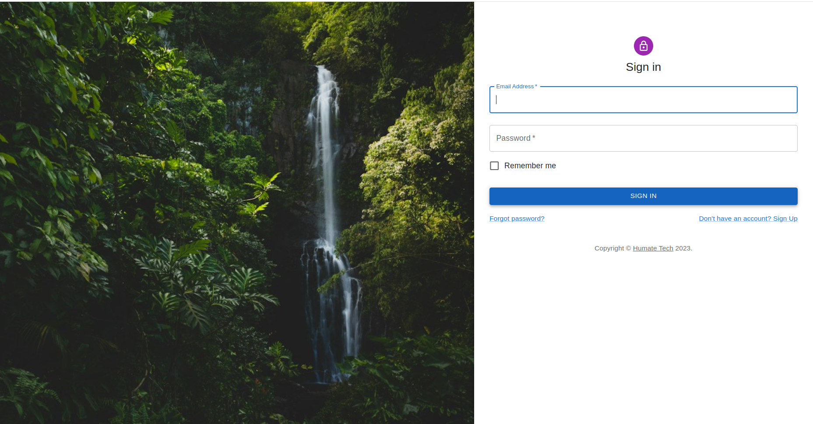

Humate FrontEnd.

## Getting Started

First, run the development server:

```bash
npm run dev
# or
yarn dev
# or
pnpm dev
# or
bun dev
```

Open [http://localhost:3000](http://localhost:3000) with your browser to see the result.

To build:

```bash
npm run build
```

Tests to be added. CI/CD to be added.

## Libraries used

- [MUI](https://mui.com/material-ui/react-dialog/)
- [Next](https://nextjs.org/docs/)
- Tailwind
- I18Next
- Husky

## User Guide

PC:








Mobile:


